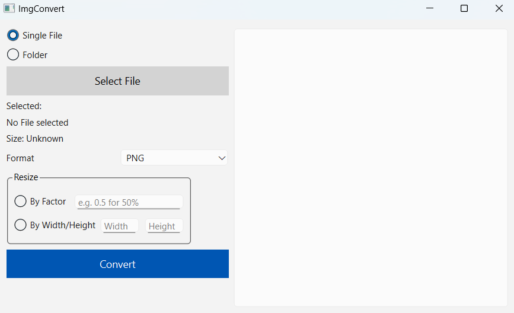

<h1 align="center">📸 imgconvert</h1>
<p align="center"><i>Your image, your format, your size!</i></p>

<p align="center">
  
  
  
</p>

---

**imgconvert** is a lightweight, blazing-fast CLI tool that lets you **convert, shrink, enlarge, and change images into new formats** – all with a single command.  
Whether JPG to PNG, PNG to WEBP, or even an entire folder – **imgconvert** does it in seconds.

---

## Project Files & Features 📂

| File / Feature | Status |
|----------------|--------|
| `imgconvert.py` |  |
| `gui.py` |  |

## ✨ Features

- 🔄 **Change format** – JPG → PNG, PNG → WEBP, BMP → JPG … whatever you want.
- 📏 **Resize images** – by percentage or directly to fixed width/height.
- 📂 **Batch mode** – convert a whole folder of images in one go.
- 🛠 **Simple & fast** – just a few arguments and you’re good to go.
- 💡 **No Photoshop required** – CLI is more than enough.

---

## 🚀 Installation

1. **Clone the repository**  
   ```bash
   git clone https://github.com/Trigger-45/imgconvert.git
   cd imgconvert
   ```
2. **Install dependencies**
    ```bash
    pip install -r requirements.txt
    ```

---

## Requirements
- Pillow
- PySide6

## 🖼️ Screenshots

### GUI Example


## ⚙️ Setup Tool (optional)

### 💻 Windows – Create EXE and add to PATH

1. Create EXE with PyInstaller
    1. Open CMD or PowerShell.
    2. Navigate to your project folder:
    ```bash
    cd C:\path\to\imgconvert
    ```
    3. Create the executable
    ```bash
    pyinstaller --onefile imgconvert.py
    ```
    - --onefile → everything in one file
    - The EXE will be created in dist\imgconvert.exe.
2. Add folder to PATH
    1. Press Win + S, type *Environment Variables* and open “Edit the system environment variables”.
    2. Click “Environment Variables…” at the bottom.
    3. Find Path in System variables → Edit.
    4. Click New → add C:\path\to\dist → close with OK.
    5. Restart CMD/PowerShell to apply changes.

3. Run EXE from anywhere

    - Now you can use the tool from any directory
    - The EXE is globally available, no Python required

### 🐧 Linux – Create EXE and add to PATH

1. Create EXE with PyInstaller

    1. Open the terminal.
    2. Navigate to your project folder:
    ```bash
    cd /path/to/imgconvert
    ```
    3. Create the executable:
    ```bash
    pyinstaller --onefile imgconvert.py
    ```
    - The EXE will be created in dist/imgconvert.

2. Make it executable
```bash
chmod +x dist/imgconvert
```
- This makes the file executable

3. Add folder to PATH
    - To run it from anywhere, just add the dist/ folder to your PATH:
    ```bash
    echo 'export PATH="/path/to/imgconvert/dist:$PATH"' >> ~/.bashrc
    source ~/.bashrc
    ```
    - Replace /path/to/imgconvert with the absolute path to your project.


4. Run EXE from anywhere
    - Now you can use the tool from any directory
    - The EXE is globally available, no Python required

## 🖥️ Usage

1. Convert a single image
    ```bash
    python imgconvert.py -i image.png jpg
    ```
    ➡ image.png → output/image.jpg
2. Resize by percentage
    ```bash
    python imgconvert.py -i image.png jpg -rf 0.5
    ```
    ➡ image.png → output/image.jpg at 50% size
3. Resize to fixed values
    ```bash
    python imgconvert.py -i image.png jpg -rt 800 600
    ```
    ➡ image.png → output/image.jpg at 800x600
4. Convert an entire folder
    ```bash
    python imgconvert.py png -d /path/to/folder
    ```

5. Convert images with GUI
    ```bash
    python imgconvert.py
    ```

> **_NOTE:_**  If the tool is set up (Path added), you only need to replace `python imgconvert.py` with `imgconvert`. The arguments remain the same.

## ⚡ Examples

| Input | Output | Action |
|---------|---------|--------|
| `-i holiday.jpg png` | `holiday.png` | JPG → PNG |
| `-i image.png webp -rf 0.25` | `image.webp` | 75% smaller |
| `png -d ./photos` | All PNGs in output | Batch folder |

---

## 🧩 Planned Features
- [x] User-friendly **GUI version** for click-based usage
- [ ] Improve transparency handling
- [ ] Optionally preserve Exif data
- [ ] Support more formats (TIFF, ICO, etc.)
- [ ] Full-featured **CLI version** with extended options


---

## 📝 To-Do

- [ ] Write tests for different image formats  
- [ ] Improve error handling (invalid inputs, broken files)  
- [ ] Add logging (optional with `--verbose`)  
- [ ] Performance benchmarking on large folders  
- [ ] Further develop GUI and release first beta  
- [ ] Add image preview in folder view (GUI with QScrollArea)

---

## 📜 License
This project is licensed under the [MIT License](LICENSE).
